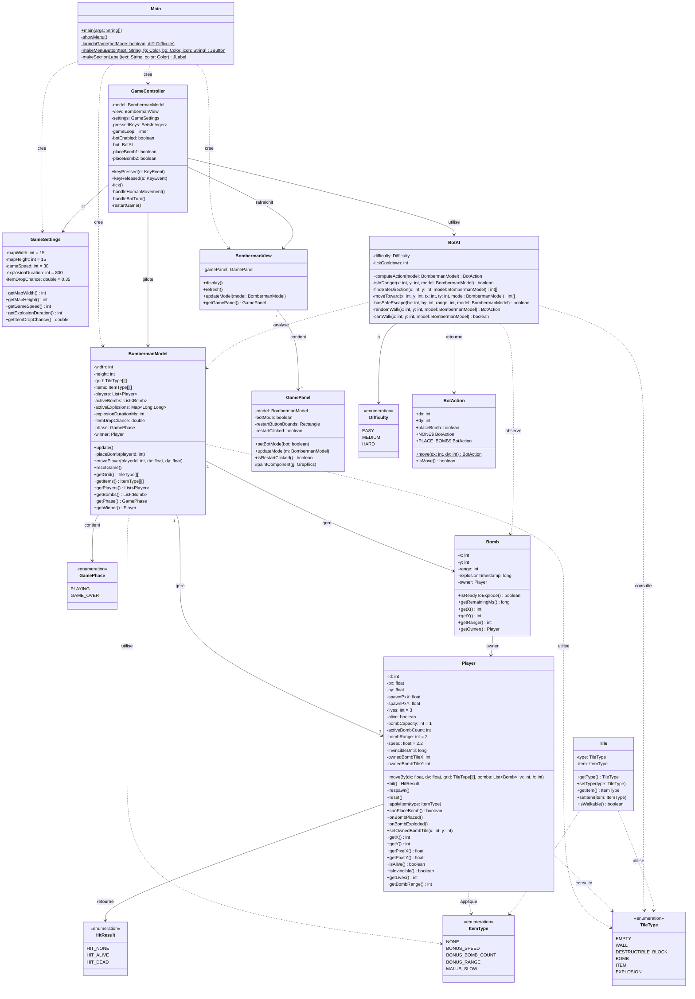

# Diagramme de classe — Bomberman

---

## Légende des relations

| Symbole | Signification |
|---|---|
| `-->` | Association (utilise / contient) |
| `..>` | Dépendance (crée / appelle) |
| `"1" --> "2"` | Cardinalité : 1 modèle gère 2 joueurs |
| `"1" --> "*"` | Cardinalité : 1 modèle gère N bombes |
| `<<enumeration>>` | Enum Java |
| `$` après une méthode | Méthode statique |
| `#` devant une méthode | Méthode protégée (protected) |
| `-` devant un attribut | Attribut privé |
| `+` devant un attribut/méthode | Public |

---

## Notes importantes

- `Tile` est déclarée dans le code mais jamais instanciée — la grille utilise directement `TileType[][]`
- `GamePhase` et `HitResult` sont des enums internes à leurs classes (`BombermanModel` et `Player`)
- `Difficulty` et `BotAction` sont des classes internes à `BotAI`
- `GameController` extends `KeyAdapter` (non représenté pour simplifier)
